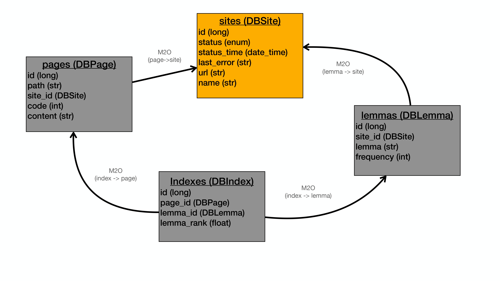
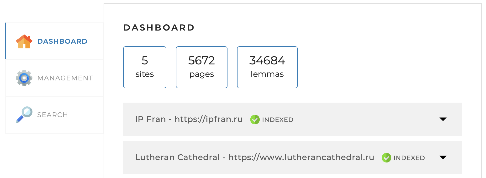

# SEARCHENGINE
___

### Education project


---

Hey there :wave:

Here you can find a search engine module, it is working with prepared root sites url list to make the full indexation for all the child links and create the index by page/word.

You can use the backend part like a search module for any website.

### Navigation:
1. [How does it work? SEARCH](https://github.com/dmitriy-utkin/searchengine/blob/main/README.md#how-does-it-work-search)
    1. [What is the "search index"?](https://github.com/dmitriy-utkin/searchengine/blob/main/README.md#what-is-the-search-index)
    2. [What is the "normal form"?](https://github.com/dmitriy-utkin/searchengine/blob/main/README.md#what-is-the-normal-form)
    3. [How works a search by the requested words](https://github.com/dmitriy-utkin/searchengine/blob/main/README.md#how-works-a-search-by-the-requested-words)
    4. [Search configuration](https://github.com/dmitriy-utkin/searchengine/blob/main/README.md#search-configuration)
2. [How does it work? INDEXING](https://github.com/dmitriy-utkin/searchengine/blob/main/README.md#how-does-it-work-indexing)
3. [How launch a serchengine app](https://github.com/dmitriy-utkin/searchengine/blob/main/README.md#how-launch-a-serchengine-app)
4. [Model](https://github.com/dmitriy-utkin/searchengine/blob/main/README.md#model)
   1. [Site](https://github.com/dmitriy-utkin/searchengine/blob/main/README.md#site)
   2. [Page](https://github.com/dmitriy-utkin/searchengine/blob/main/README.md#page)
   3. [Lemma](https://github.com/dmitriy-utkin/searchengine/blob/main/README.md#lemma)
   4. [Index](https://github.com/dmitriy-utkin/searchengine/blob/main/README.md#index)
6. [Services](https://github.com/dmitriy-utkin/searchengine/blob/main/README.md#services)
   1. [Indexing](https://github.com/dmitriy-utkin/searchengine/blob/main/README.md#indexingservice)
   2. [Search](https://github.com/dmitriy-utkin/searchengine/blob/main/README.md#searchservice)
   3. [Statistics](https://github.com/dmitriy-utkin/searchengine/blob/main/README.md#statisticsservice) 


___

## How does it work? _SEARCH_

To make a search by marked sites (you can add it to the config file to have an opportunity of searching by the pages of this site) was created a search index.

### What is the "search index"?
This is a data structure (entity) that stores information about the found words in the "normal forms" and page where it was found. Like on page 1 was found words "A", "B", "C" and on page 2 was found words "D", "E", "F" and "A". So we want to find word "A": application will check which pages contain this words and reply to us two page (1 and 2). 

### What is the "normal form"?
The "normal form" is a base form of each word. I used a lucene.morphology api ([to check details about this api click here](https://lucene.apache.org)).
```xml
<dependency>
    <groupId>org.apache.lucene.morphology</groupId>
    <artifactId>morph</artifactId>
    <version>${lucene.version}</version>
</dependency>
```

### How works a search by the requested words:
1. Firstly apps founds normal words via lucene api and filters it by frequency (if this lemma contains on the site more than percent from search-setting config it is not used for searching)
2. Then apps create the SearchQueryObject with:
    * lemma (as a key)
    * total frequency by lemma for the next sorting
    * list of lemmas entry from data base
    * list of indexes by these lemmas
    * and finally queryPages by these indexes (with page from data base and rank for this lemma+page from index)
3. Then apps filters of the pages by SearchQueryObject (with sorting by totalFrequency from low to high) for the presence of pages in the previous object
4. Finally, apps make a SearchQueryResult for the page with existed searched word and sort it by relative relevance. Relative relevance building by formula `"abs/maxAbs" - by list of QueryResuls`

### Search configuration

Here you may find a few main settings:
* `maxQueryLengthToSkipChecking` - how many words in search query you want to process? If you search query less than this one or equals, application will skip a check by `maxFrequencyInPercent` based on total frequency by word divide total pages by site or without site usage
* `maxFrequencyInPercent` - if your search query size more than maxQueryLengthToSkipChecking, application will use words with total frequency by word divide total pages < `maxFrequencyInPercent`
* `withCache` - do you want to use a cache for your search results? A little more about it in the block `"Now with cached search results"`
* `cacheLongTtl` - how long your cache will be alive
```yaml
search-settings:
  maxQueryLengthToSkipChecking: 2
  maxFrequencyInPercent: 50
  defaultOffset: 0
  defaultLimit: 20
  snippetLength: 230
  withCache: true
  cacheLongTtl: 60
```

## How does it work? _INDEXING_


To be able to search some words on page, you should index it. This app can make an indexing from the root page of any sites to the all child links in multithreading mode with help of the following tools:
* ForkJoin object (FJO) `extends RecursiveAction`, where all the magic happens. This obj make a checking this link and collect all the date about page (in accordance to the Page doc, you may find it bellow)
* Then FJO create a HtmLParser object to collect information about each word on this page with help of lucene.morphology api and create an index for each of them
* Third step is saveAll collected object (list of lemmas, list of indexes, page) and update statusTime for indexing Site (you may find a description of this Entity below as well)
* Finally, FJO create a subtask and launch.

*__One more comment about indexing:__ it works in multithreading mode for each of the marked in config files sites* 

## How to launch a serchengine app
To launch it in local machine, you need to do a few simple things after downloading:
1. Fist of all you need to create a database on localhost (the best option is a MySQL DB to do nothing changes in pom.xml etc.)
2. Then you need a put the login information to the config file `application.yaml` to the bellow points (username, password, port number and database name:
   ```yaml
      spring:
        datasource:
          username: USERNAME
          password: PASSWORD
          url: jdbc:mysql://localhost:PORT_NUM/DATABASE_NAME?useSSL=false&requireSSL=false&allowPublicKeyRetrieval=true
   ```
3. Then you need to make a more sensitive settings for indexing page in the bellow points:
   * userAgent - name of your copy of this search application
   * referrer - it is a location where you want to make a request to sites for indexing from (ex. https://www.google.com, because why not)
   * redirect - would you like to index pages with http code "3xx" (pages what was moved to another resource)
   * sleep - how long you want to sleep after each request to the site`s page (to avoid any problem with cyber security)
   * timeout - how long your app will wait for connecting
   * ignoreHttpErrors - if you want to index pages with some http error (i advice to keep it true, because this app will skip pages with error pages (like "4xx" / "5xx") automatically)
   * and __the core of this app__: sites. This option contains two parameters
     * url - link to the root page of sites that you need to add to the app
     * name - to have a correct naming of this site

  ```yaml
     indexing-settings:
       userAgent: DeepSearchBot
       referrer: http://www.google.com
       redirect: true
       sleep: 200
       timeout: 10000
       ignoreHttpErrors: true
       sites:
         - url: https://site.example/
           name: Site name example
         - url: http://second.sites.example/
           name: Second site name axample
         ##   this field is a list, you may add as much as you need sites
  ```
___
## Model:



### Site

Here we have an information about this site:
* Site ID
* Site url
* Site name
* Site status _(INDEXED / INDEXING / FAILED)_
* Site status time _(when it was updated last time?)_

### Page
Here we have information about each page by the sites:
* Page ID
* Page path _(uri)_
* Site ID for this page
* Page HTTP code
* Page HTML content

### Lemma
Here we have information about all the lemmas by sites:
* Lemma ID
* Site ID for this lemma
* Lemma
* Frequency by this lemma on site

### Index
Here we have information about indexes by lemma+page
* Index ID
* Page by this index
* Lemma by this index
* Lemma rank by this index (how many times this lemma was detected on page)

___
## Services:
### IndexingService


This is the service for using an indexation functionality. Here you can find a main methods:
* startIndexing() - to launch full indexing of sites from config
* stopIndexing() - to stop an indexing
* indexPage(String url) - to launch an indexing for one page **(if this site is exists in config)**

```java
    @Service
    public interface IndexingService {
        ResponseEntity<ResponseService> startIndexing();
        ResponseEntity<ResponseService> stopIndexing();
        ResponseEntity<ResponseService> indexPage(String url);
    }
```

### SearchService


This is the service for using a search functionality. Here you can find only one main method:
* search(String query, String site, int offset, int limit) - to launch a locking for the search word by indexes
```java
    @Service
    public interface SearchService {
        ResponseEntity<ResponseService> search(String query, String siteUrl, int offset, int limit);
   }
```


### StatisticsService


This is the service to get actual information about application. Here you can find only one method as well:
* getStatistics() - to collect actual information: how many sites, pages, lemmas was indexing, also about each of the sites with detail info
```java
   @Service
   public interface StatisticsService {
        ResponseEntity<ResponseService> getStatistics();
   }
```


### ResponseService

This is the last service, it is using to create a correct response for each of the previous methods(success or error response)

```java
    @Value public static class ErrorResponse implements ResponseService, Result, Error {
         public ErrorResponse(String error) {
            this.result = false;
            this.error = error;
         }
         Boolean result;
         String error;
    }
```
